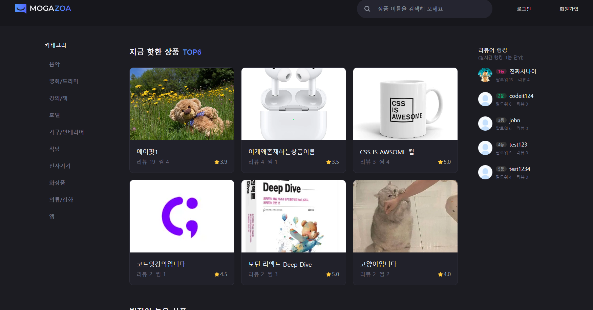

# Mogazoa

상품을 등록하고 리뷰나 비교를 통해 유저들이 상품에 대해 소통하는 사이트입니다.

## Info

링크 : https://part4-mogazoa-three.vercel.app/ 
개발기간 : 2024.7.8 ~ 2024.8.7 
작업자 : 김미소, 김현서, 이상우, 장재혁, 최준엽 

## Skill

Framework : Next.js (App Router) 
Language : TypeScript 
Library : Axios | React-Hook-Form | React-Query | Zustand | Swiper | Sonner 
Styling : Tailwind CSS | SCSS Module | shadcn/ui (기반: Radix UI) 
Git: 3-way merge 
협업 : Discord | Flow
